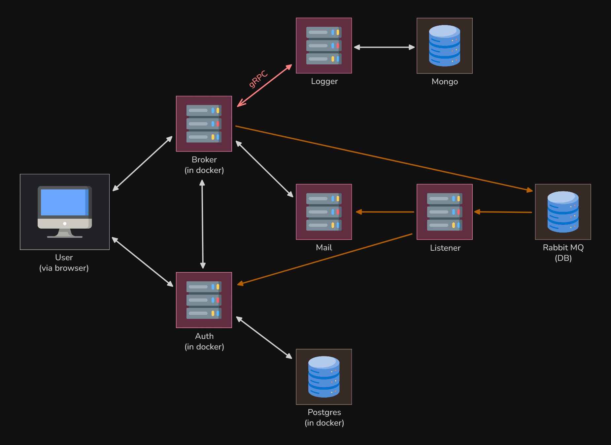

# Go Microservices Project

A distributed microservices application built with **Golang**, **Docker**, and **RabbitMQ** for event-driven communication.

## Overview

**Services:**

1. **Frontend** – Web UI with Go templates, proxies API calls
2. **Broker** – API gateway, routes requests, handles RabbitMQ events
3. **Authentication** – JWT auth, PostgreSQL storage, bcrypt hashing
4. **Logger** – Central logging (REST + gRPC), MongoDB storage
5. **Mail** – SMTP sending, templates, DKIM signing, RabbitMQ async processing
6. **Listener** – Consumes RabbitMQ events with retry/backoff

**Architecture:**

*diagram is also available in light mode for you weirdos at [light mode](./docs-assets/architecture_diagram_light.png)*

## Tech Stack

* **Backend**: Golang
* **Databases**: PostgreSQL (auth), MongoDB (logs)
* **Broker**: RabbitMQ
* **Email Testing**: MailHog
* **Web Server**: Caddy (with HTTPS, security headers)
* **Containerization**: Docker, Docker Swarm

## Features

* **gRPC**: Protobuf definitions, unary + streaming RPC, REST fallback
* **Security**: HSTS, X-Content-Type-Options, Referrer-Policy, JWT, encrypted DB connections
* **Deployment**: Swarm config with global/replicated modes, persistent volumes, multi-host ready
* **Database**: Pooling, migrations, multi-backend support

## Development

**Setup:**

```bash
git clone https://github.com/Yugsolanki/go-micro.git
cd go-micro
make up_build
```

**Services:**

* Frontend: [http://localhost:8080](http://localhost:8080)
* MailHog: [http://localhost:8025](http://localhost:8025)
* Auth API: [http://localhost:8082](http://localhost:8082)

**Commands:**

```bash
make up_build   # Build all
make start      # Start frontend
make stop       # Stop frontend
make down       # Stop all
```

## Deployment (Swarm)

```bash
docker swarm init
docker volume create caddy_data
docker volume create caddy_config
docker stack deploy -c project/swarm.yml myapp
```

## Configuration

* Development: `project/docker-compose.yml`
* Production: `project/swarm.yml`
* Env vars: DB connection strings, email service settings, RabbitMQ details

## Monitoring

* Logs: MongoDB
* Queues: RabbitMQ management interface
